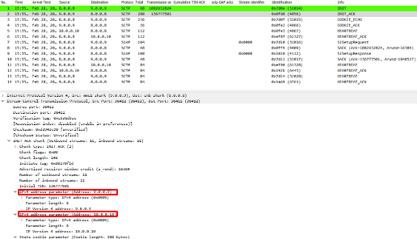
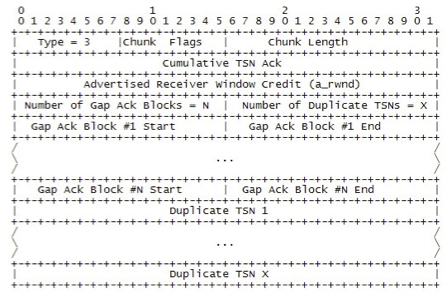
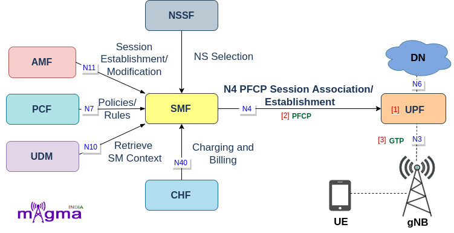

# Week 2: Protocol Stack

## 協定堆疊 (Protocol Stack)

在 5G 網路中，UE（使用者設備）與網路之間的通訊以及核心網路內部不同網路功能（NF）之間的通訊，都依賴於一組定義好的協定。這些協定共同構成了 5G 的協定堆疊。本週我們將探討幾個關鍵的協定，它們是實現 5G 各種服務的基礎。

---

### NGAP (Next-Generation Application Protocol)

NGAP 是在 5G 基地台（gNB）和 AMF（存取與行動管理功能）之間使用的控制平面協定。它取代了 4G 中的 S1AP 協定。

- **主要功能**:
    - **UE 上下文管理 (UE Context Management)**: 建立、修改和釋放 UE 在 AMF 和 gNB 中的上下文資訊。
    - **PDU 會話管理 (PDU Session Management)**: 管理 UE 的 PDU 會話，例如建立和釋放與 UPF 連接所需的資源。
    - **行動性管理 (Mobility Management)**: 處理 UE 在不同 gNB 之間移動時的切換（Handover）程序。
    - **傳輸 NAS 訊息**: 在 UE 和 AMF 之間透明地傳輸 NAS 訊息。

*圖：控制平面協定堆疊，顯示 NGAP 位於 gNB 與 AMF 之間*

---

### NAS (Non-Access Stratum)

NAS 是 UE 和 AMF 之間直接通訊的協定，它「透明地」穿過基地台（gNB）。"Non-Access Stratum" 的意思是它與存取技術（如無線電）無關。

- **主要功能**:
    - **註冊管理 (Registration Management)**: UE 開機後向網路註冊。
    - **連線管理 (Connection Management)**: 建立和釋放與網路的信令連線。
    - **行動性管理 (Mobility Management)**: 追蹤 UE 的位置（Tracking Area Update）。
    - **會話管理 (Session Management)**: 建立、修改和釋放 PDU 會話。

NAS 訊息分為兩大類：
1.  **5GMM (5G Mobility Management)**: 負責行動性相關程序。
2.  **5GSM (5G Session Management)**: 負責 PDU 會話相關程序。

---

### PFCP (Packet Forwarding Control Protocol)

PFCP 是 5G 核心網路中一個非常重要的協定，它在 SMF（控制平面）和 UPF（使用者平面）之間運作，實現了 CUPS（Control and User Plane Separation）架構。

- **主要功能**:
    - **建立/修改/刪除 PDU 會話**: SMF 透過 PFCP 協定，指示 UPF 如何處理特定 PDU 會話的數據流。
    - **安裝轉發規則 (Forwarding Rules)**: SMF 在 UPF 上安裝 Packet Detection Rules (PDRs)、Forwarding Action Rules (FARs) 等規則，告訴 UPF 如何識別、轉發、阻擋或緩存用戶數據。
    - **報告使用情況**: UPF 可以向 SMF 報告數據使用量，用於計費。

這種分離使得使用者平面（UPF）可以根據流量需求靈活地部署在網路邊緣，以減少延遲，而控制平面（SMF）則可以集中部署。

---

### SBI (Service-Based Interface)

5G 核心網路採用了服務化架構（Service-Based Architecture, SBA），其中每個網路功能（NF）都提供一組服務給其他 NF 使用。SBI 就是這些 NF 之間通訊的介面。

- **技術基礎**:
    - 基於 RESTful API，使用 HTTP/2 協定。
    - 使用 JSON (JavaScript Object Notation) 作為數據格式。
    - 每個 NF 都有一個 Profile，儲存在 NRF（NF Repository Function）中，包含了它提供的服務資訊。

- **運作方式**:
    1.  **NF 發現 (NF Discovery)**: 當一個 NF（例如 AMF）需要使用另一個 NF（例如 SMF）的服務時，它會先向 NRF 查詢，找到可用的 SMF 實例。
    2.  **服務請求 (Service Request)**: AMF 向 SMF 發送一個 HTTP/2 請求（如 POST, GET, PUT）來觸發一項服務（例如，建立 PDU 會話）。
    3.  **服務回應 (Service Response)**: SMF 處理請求後，回傳一個 HTTP/2 回應。

SBA 和 SBI 的設計大大提高了網路的靈活性、可擴展性和可維護性。

## 使用 Wireshark 分析封包

### SCTP (Stream Control Transmission Protocol)

SCTP 定義在 RFC 4960 中，是一種面向連接的協定，主要用於在 IP 網路上傳輸訊息。它支援多個流（Streams）和多宿主（Multi-homing），適合用於需要高可靠性和順序保證的應用。
- 不是使用資料報（datagrams）或區段（segments），SCTP 使用的是「區塊」（Chunks）。
- 區塊(Chunk)：SCTP 封包中的資訊單元。區塊可以包含用戶資料或 SCTP 控制資料。
- 多個區塊可以被打包在一個 SCTP 封包內，直到達到 MTU 大小為止，INIT、INIT ACK 和 SHUTDOWN COMPLETE 區塊除外。
- 端點(Endpoint)：SCTP 封包的邏輯發送者/接收者。在多宿主主機上，SCTP 端點對其對等端表現為一組可用的目的地傳輸位址（可發送 SCTP 封包的位址）和一組可用的來源傳輸位址（可接收 SCTP 封包的位址）的組合。
- SCTP 使用「串流」(stream) 作為傳送有序應用訊息的邏輯通道。串流是單向的。

- 多宿主（Multihoming）可以在 INIT ACK 階段建立。
- 這就是我們如何從基地台（Cell Site）到 AMF/MME 動態建立備援路徑。
- 備援路徑會啟動心跳（heart beat）機制。

#### 選擇性確認（Selective Ack's）

- 確認訊息會攜帶一方已接收到的所有傳輸序列號碼（Transmission Sequence Number, TSN）。
- 也就是說，有一個累積 TSN 確認值（Cumulative TSN Ack value），表示在接收端已成功重組的所有資料。
- 還有間隙區塊（Gap Blocks），用來指示哪些資料區塊段已到達，而中間有些資料區塊遺失。

#### 路徑監控（Path Monitoring）
- HEARTBEAT 區塊會在所有路徑上發送。每個 HEARTBEAT 區塊都必須由 HEARTBEAT-ACK 區塊進行確認。
- 每個路徑都被分配一個狀態：主動（active）或非主動（inactive）。
- 當心跳在特定時間內未被確認的事件數量，或重傳事件數量超過某個可配置的限制時，對等端點會被視為不可達，且關聯將透過 ABORT 區塊終止。

:::info
🤔 Bonus（第一個成功答題的人總成績 +1 分）
設定 free5GC（AMF）令其使用 SCTP multi-homing 功能，且在不刻意送出 Abort 封包的前提下觸發 **當心跳在特定時間內未被確認的事件數量，或重傳事件數量超過某個可配置的限制時，對等端點會被視為不可達，且關聯將透過 ABORT 區塊終止。** 所描述的狀況。
:::

### GTP

> 出處：https://docs.magmaindia.org/Free5gc_5gCore/upf/upf.html

GTP（GPRS Tunneling Protocol）是一種用於在移動網路中傳輸用戶數據的協定。它主要用於 4G 和 5G 網路中資料層的傳輸。
UPF 使用的是 GTP-U v1 協定，N3、N6 和 N9 接口皆使用 GTP-U v1 協定來傳輸用戶數據。GTP-U 協定允許在 UPF 和其他網路元件之間建立隧道，以便在不同的 PDU 會話之間轉發數據。

---

## 本週作業

1.  **問題**:
    - 請解釋 NGAP 和 NAS 協定之間的主要區別是什麼？為什麼需要這兩種不同的協定？
    - CUPS 架構為什麼對 5G 網路很重要？PFCP 在其中扮演了什麼角色？
    - 什麼是服務化架構 (SBA)？與傳統的點對點（Point-to-Point）介面相比，它有什麼優點？

2.  **實作**:
    - (可選) 使用 Wireshark 捕獲一個 5G 裝置的網路流量（如果條件允許），嘗試過濾並識別出 NAS 訊息。觀察註冊（Registration）或 PDU 會話建立（PDU Session Establishment）過程中的訊息交換。
